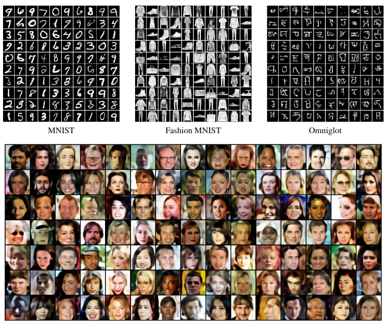
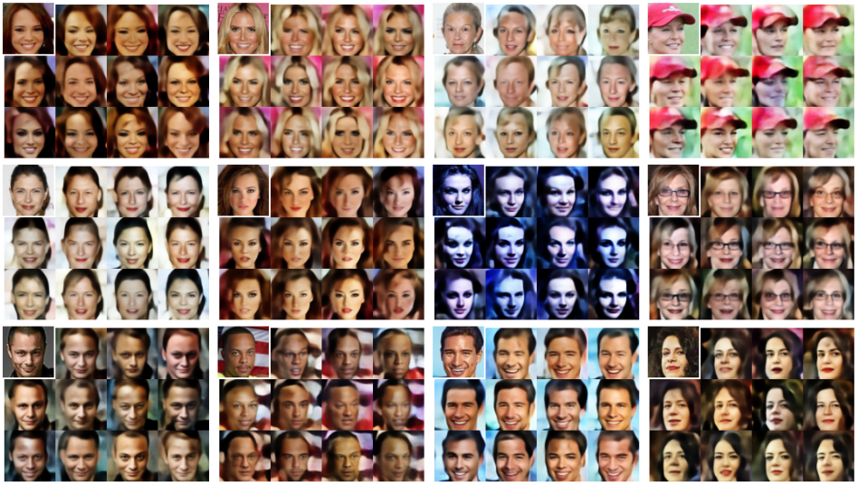

## Exemplar-VAE
Code for reproducing results in [Exemplar VAE](https://arxiv.org/abs/2004.04795) paper; Accepted to NeurIPS 2020

## Requirements
```
pip3 install -r requirements.txt
```
## Exemplar VAE Samples



## Exemplar Based Generation
```
python3 analysis.py --dir pretrained_model  --generate
```



## Density Estimation 
```
python3 density_estimation.py --prior exemplar_prior --dataset {dynamic_mnist|fashion_mnist|omniglot} --model_name {vae|hvae_2level|convhvae_2level} --number_components {25000|11500} --approximate_prior {True|False} 
```


## Data Augmentation
```
python3 analysis.py --dir pretrained_model  --classify
```


## Cyclic Generation
```
python3 analysis.py --dir pretrained_model  --cyclic_generation
```


