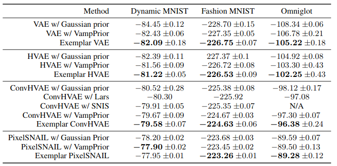
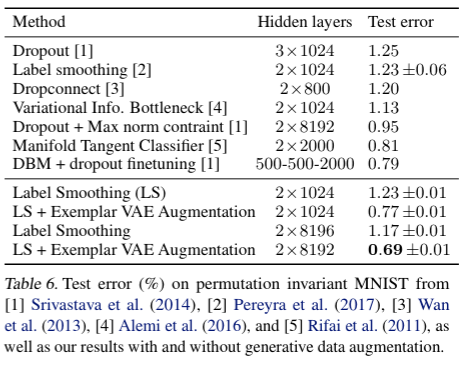
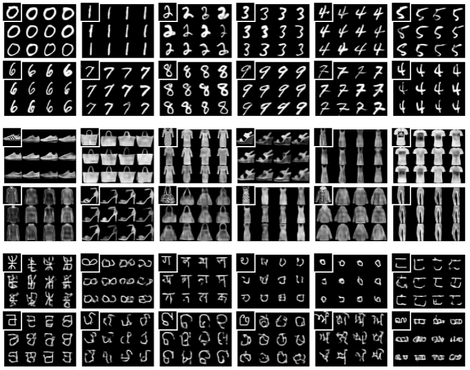
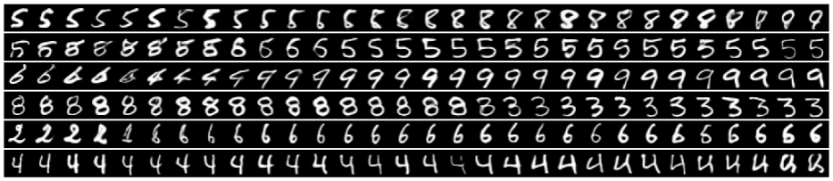

## Exemplar-VAE
Repository for reproducing results in the paper. 

## Requirements
```
pip install -r requirements.txt
```

## Density Estimation 
```
python3 density_estimation.py --prior exemplar_prior --dataset {dynamic_mnist, fashion_mnist, omniglot} --model_name {vae, hvae_2level, convhvae_2level} --number_components 25000 --approximate_prior {True, False} 
```



## Data Augmentation
```
python3 analysis.py --dir pretrained_model  --classify
```



## Exemplar Based Generation
```
python3 analysis.py --dir pretrained_model  --generate
```



## Cyclic Generation
```
python3 analysis.py --dir pretrained_model  --cyclic_generation
```


